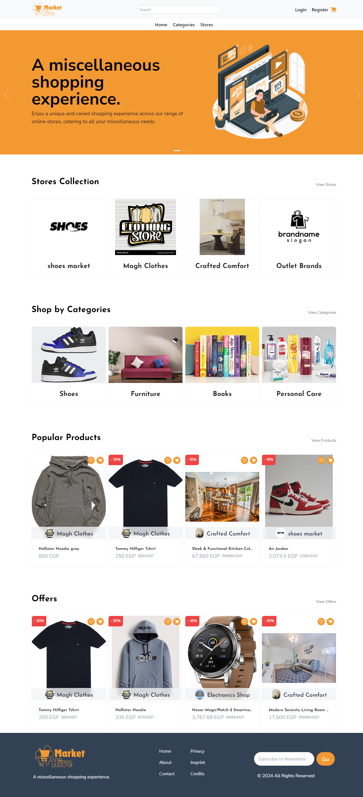
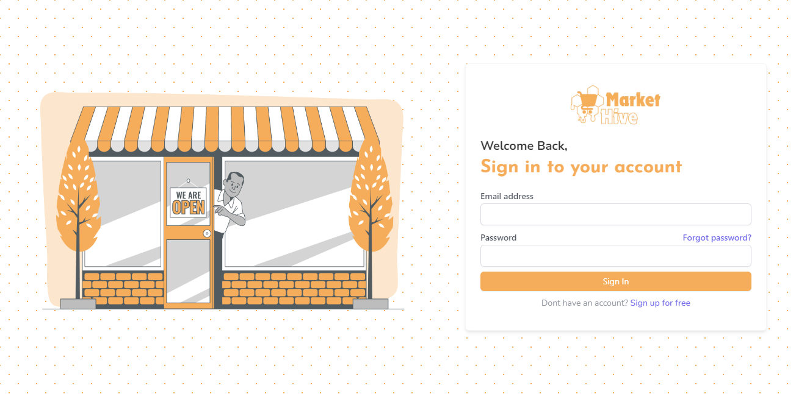
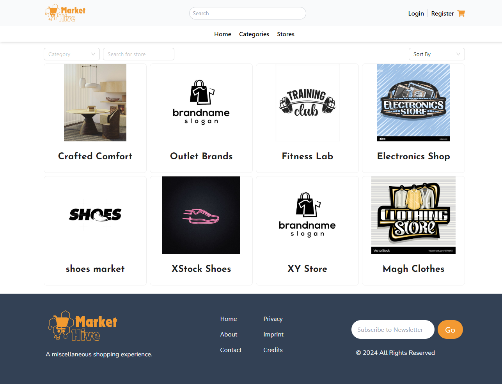
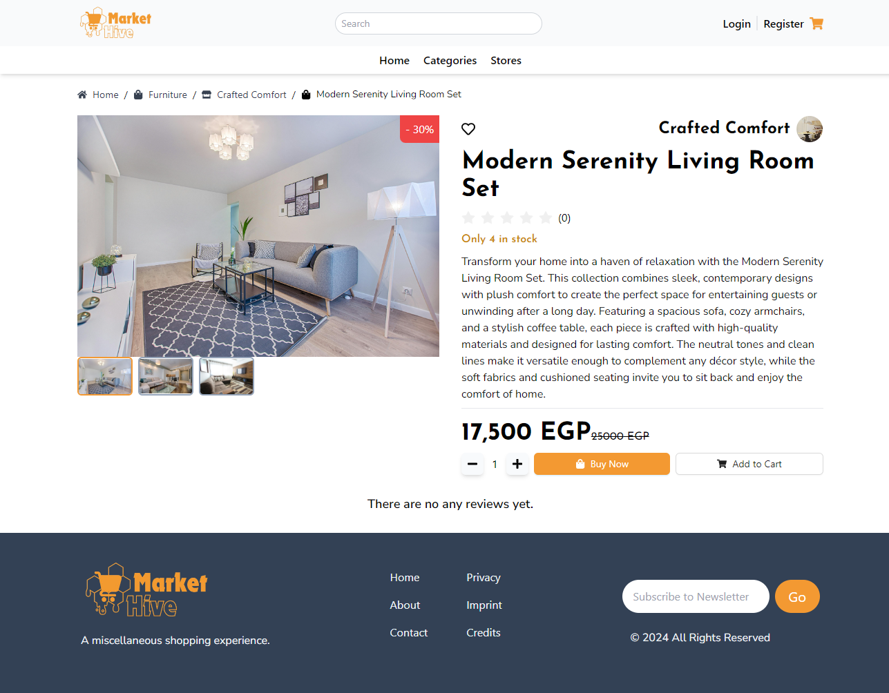
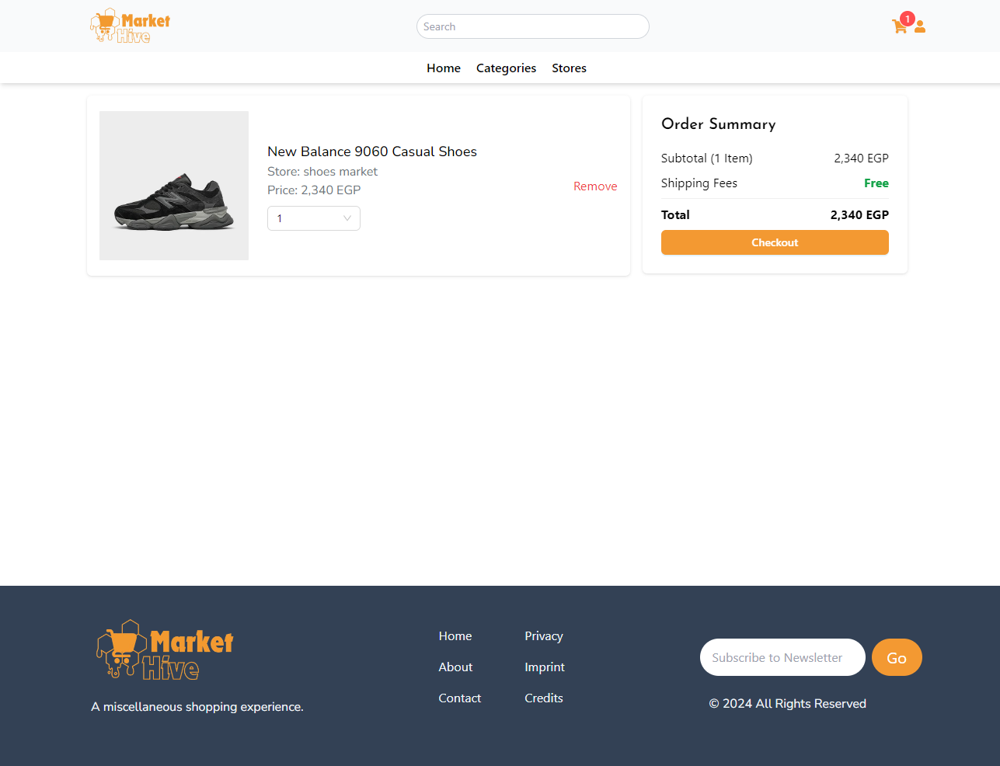
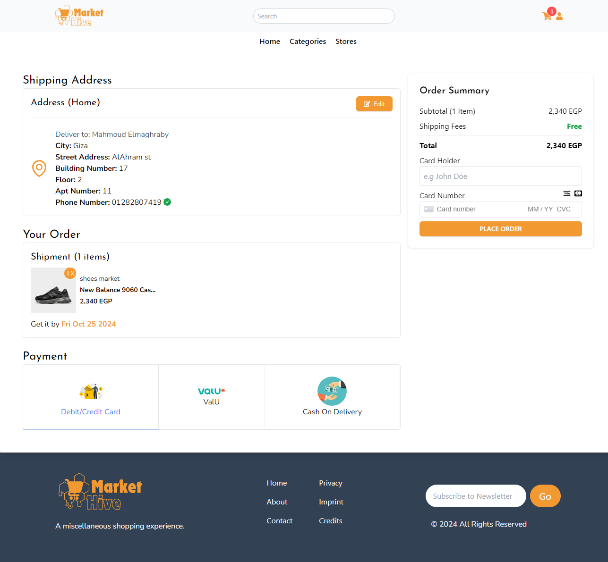

# Market Hive Web Client

This project is a dynamic marketplace platform that consolidates multiple online stores into a single interface, enabling users to easily browse, search, and purchase products from different vendors. The platform enhances user experience with an intuitive design and seamless integration between the frontend and backend, allowing for secure user authentication, product browsing, and order management.


## Features

- **Vendor Management:** Multiple vendors can showcase their products.
- **Product Search & Filtering:** Users can easily find products across all vendors.
- **Cart & Checkout:** Seamless checkout process with multiple payment options.
- **User Authentication:** Secure login and registration with Firebase.
- **Responsive Design:** Fully optimized for desktop and mobile views.

## Tech Stack
  
**Client-side**

- ReactJS (VITE): Utilized for building a fast and scalable frontend.
- TailwindCSS: For easy-to-maintain and responsive styling.
- React Router: For managing routes and navigation between pages.
- Antd Design: For additional UI components.

**Server-side**

- Firebase Authentication: Used for secure login and user management.
- Firestore Database: A NoSQL cloud database for storing user and product data.
- Firebase Cloud Storage: Used to store product images and other static assets.
- Stripe: Integrated for handling secure payments within the app.

## Screenshots










## Demo

http://market-hive-iota.vercel.app/

## Installation

1 - Clone the repository:

```bash
  git clone https://github.com/yourusername/marketplace-platform.git
```
2 - Navigate to the project directory:

```bash
cd marketplace-platform
```

3 - Install the necessary dependencies:

```bash
npm install
```

4 - Start the development server:

```bash
npm run dev
```
    
## Configuration

To connect the app with Firebase, update the firebaseConfig object in the firebase.js file with your Firebase project credentials:

```js
const firebaseConfig = {
  apiKey: "YOUR_API_KEY",
  authDomain: "YOUR_PROJECT_ID.firebaseapp.com",
  projectId: "YOUR_PROJECT_ID",
  storageBucket: "YOUR_PROJECT_ID.appspot.com",
  messagingSenderId: "YOUR_MESSAGING_SENDER_ID",
  appId: "YOUR_APP_ID",
};

```
Stripe is integrated for secure payments:
 ```js
 const stripe = require('stripe-client')(process.env.STRIPE_PUBLISHABLE_KEY);

 ```

## Contributing

Feel free to submit issues or pull requests to help improve this platform. Contributions are always welcome!


## License
This project is licensed under the MIT License.


[MIT](https://choosealicense.com/licenses/mit/)


## 🚀 About Me

I’m Mahmoud Elmaghraby, a software developer specializing in frontend development with expertise in ReactJS/NextJS and cross-platform mobile development using React Native and Flutter. 
